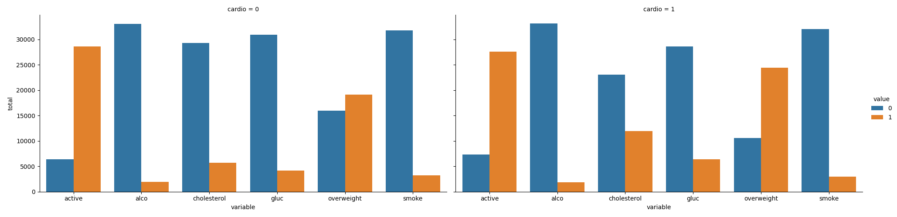
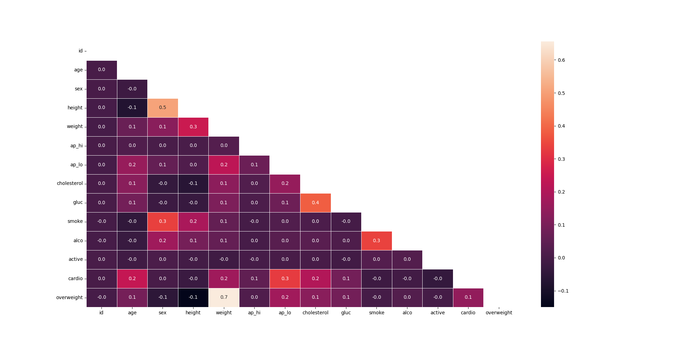

# Medical data visualizer
The tasks are to visualize and make calculations from medical examination data using `matplotlib`, `seaborn` and pandas. The dataset values have been collected during medical examinations. The app uses the dataset to explore relationship between a cardiac disease, body measurements, blood markers and lifestyle choices. The project is from ["Data Analysis with Python" course from FCC](https://www.freecodecamp.org/learn/data-analysis-with-python/).

## How to use
To run sample code and tests go to `src` folder and start `main.py` with `python` command:

```bash
cd ./src
python main.py
```

## Data
Rows in the dataset represent patients and the columns represent information like body measurements, results from various blood tests and lifestyle choices. Sample of the data:

|     | id  | age | sex | height | weight | ap_hi | ap_lo | cholesterol | gluc | smoke | alco | active | cardio |
| --- | --- | --- | --- | -----: | -----: | ----: | ----: | ----------: | ---: | ----: | ---: | -----: | -----: |
| 0  | 0 | 18393  | 2    | 168   | 62.0   | 110    | 80           | 1    | 1     | 0    | 0      | 1      | 0 |
| 1  | 1 | 20228  | 1    | 156   | 85.0   | 140    | 90           | 3    | 1     | 0    | 0      | 1      | 1 |
| 2  | 2 | 18857  | 1    | 165   | 64.0   | 130    | 70           | 3    | 1     | 0    | 0      | 0      | 1 |
| 3  | 3 | 17623  | 2    | 169   | 82.0   | 150   | 100           | 1    | 1     | 0    | 0      | 1      | 1 |
| 4  | 4 | 17474  | 1    | 156   | 56.0   | 100    | 60           | 1    | 1     | 0    | 0      | 0      | 0 |

## What the app does
* Draws two bar charts - one is for `cardio=0` and another is for `cardio=1`,
* Creates correlation matrix with `seaborn` where upper triangle is masked.

## Results

### Cardiovascular disease
Chart shows the relation between a cardiovascular disease and other parameters. You may notice that almost twice higher levels of cholesterol, glucose and slightly higher levels of overweight (BMI) for people with a cardiovascular disease.



### Medical parameters heat map
Obviously there is a high correlation between overweight and weight, because the first parameter has been calculated with the help of the second one. Patients' height is strongly related to sex (males are taller than females). A glucose level is related to cholesterol. The following pairs show some relations: sex-smoke, height-weight, diastolic blood pressure-cardiovascular disease and smoke-alcohol.

